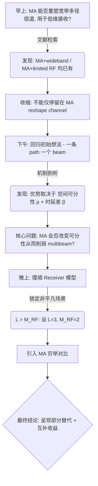

> [!abstract] TL;DR & 问题框架
> 
> 今天完成了一次重要的研究问题收缩和机制定位。在宽带多径、有限 RF 维度的接收场景下，今天的核心科研问题最终收敛为：
> 
>   
> 
> $$\boxed{\text{When does MA substitute for multibeam, and when are they complementary?}}$$

代码段

## 1. 今天的科研路线总图

- **1. 宽带 MA 研究问题定位**
    
      
    - 1.1 文献：MA + wideband 是否已有？
        
          
        
    - 1.2 reduced-dimensional reception 是否还有空白？
        
          
        
    - 1.3 multibeam 在这条路线里到底是什么角色？
        
          
        
- **2. Multibeam 的物理机制**
    
      
    - 2.1 为什么一个 beam 对一个 path 可能有收益？
        
          
        
    - 2.2 用 $\Delta\theta \rightarrow \rho$ 重新描述 spatial separability
        
          
        
    - 2.3 得到 $\rho$–$\beta$–multibeam gain 关系
        
          
        
- **3. Multibeam receiver 模型清理**
    
      
    - 3.1 SVD multibeam $\neq$ path-based multibeam
        
          
        
    - 3.2 修正非正交 branch 的噪声协方差
        
          
        
    - 3.3 $L=M_{\rm RF}$ 时为什么等于 FD？
        
          
        
    - 3.4 确定真正有意义的 $L > M_{\rm RF}$
        
          
        
- **4. MA 加入**
    
      
    - 4.1 用 exhaustive/oracle position search
        
          
        
    - 4.2 只优化 Single-beam MA 位置
        
          
        
    - 4.3 同一位置比较四类 receiver
        
          
        
    - 4.4 得到 MA–multibeam 替代/互补现象
        
          
        

## 2. 上午：探索方向是否还具备创新性

### [2-A] 早上的原始问题

当时我们想把主问题写成：

  

$$\boxed{\text{Can MA reshape wideband multipath channels for reduced-dimensional reception?}}$$

这背后的想法是：不只是用 MA 提高 channel gain，而是主动改变宽带多径的空间结构，让少 RF-chain / 低维接收器更容易接住它。

  

### [2-B] 文献检索得到的边界

今天检索以后，基本确认：

  

- 已经有人做：$\text{MA + wideband multipath}$
    
      
    
- 也有人做：$\text{MA + hybrid beamforming / limited RF}$
    
      
    
- 还有：$\text{wideband + FAS/MA + analog/hybrid processing}$
    
      
    

所以，**MA 可以 reshape wideband channel** 本身不能作为创新。但暂时没有直接看到特别明确的：

  

$$\boxed{\text{用 receive-side MA 主动提高宽带多径对有限维 receiver 的可接收性}}$$

于是我们当时把问题进一步收缩成：$\text{MA reshapes space-frequency structure} \rightarrow \text{fewer RF dimensions}$。

  

> [!success] 上午的阶段性收获
> 
> 划清了：
> 
>   
> 
> - **MA + wideband** $\rightarrow$ 已有
>     
>       
>     
> - **MA + limited RF** $\rightarrow$ 已有
>     
>       
>     
> - **MA + wideband + low-dimensional multipath reception** $\rightarrow$ 可能仍有空间
>     
>       
>     

## 3. 下午第一个转折：发现multibeam 好像被削弱了

这是今天非常关键的一步。导师最初提出 multibeam，并不是为了“我非得做个 multibeam”，而是：

**Path 1 $\rightarrow$ Beam 1** / **Path 2 $\rightarrow$ Beam 2** $\rightarrow$ 分别保存多径能量 $\rightarrow$ 数字端重新组合

  

> [!question] 核心问题其实是：
> 
>   
> 
> $$\boxed{\text{不同 multipath 是否值得分开接收？}}$$

## 4. 下午：从 $\Delta\theta$ 换成真正的物理量 $\rho$

之前一直用 $\Delta\theta$ 讨论两条 path 是否分得开。今天换成：

  

$$\boxed{\rho = \frac{\vert{}a_1^Ha_2\vert{}^2}{\Vert{}a_1\Vert{}^2\Vert{}a_2\Vert{}^2}}$$

它直接衡量：对当前阵列来说，两条 path 的空间 steering response 有多相似。

  ![[png：Pasted image 20260831214823.png]]
### [4-A] 得到第一条重要仿真规律

画出了 $R_{\rm MB}-R_{\rm Single}$ 关于 $(\rho,\beta)$ 的二维图，结果很清楚：

  

$$\boxed{\rho\uparrow \Rightarrow R_{\rm MB}-R_{\rm Single}\downarrow}$$

也就是：

  

- 当 $\rho\approx1$：两条 path 对阵列来说几乎是同一个 spatial mode。一个 beam 已经能同时吃到它们：$R_{\rm MB}\approx R_{\rm Single}$。
    
      
    
- 当 $\rho\ll1$：两条 path 空间上明显不同，single beam 很难同时匹配，multibeam 才真正开始有优势。
    
      
    

## 5. 下午得到第二条重要规律：只有空间可分还不够

图里还明显看到：$\beta=\frac{\Delta\tau}{T_s}\approx0$ 时，即使 $\rho$ 很低，multibeam gain 仍然不大。因为两条 path 如果 delay 一样：

  

$$h[k] = \left( \alpha_1a_1+\alpha_2a_2 \right) e^{-j2\pi\nu_k\tau}$$

对整个宽带来说仍然接近一个固定空间向量。

  

> [!info] Multibeam 的作用条件升级
> 
> 从“角度差大”升级成了：
> 
>   
> 
> $$\boxed{\text{spatial separability} + \text{temporal/frequency diversity}}$$
> 
> 即：
> 
>   
> 
> $$\boxed{\rho\text{ 较小} \quad+\quad \beta\text{ 足够大}}$$
> 
> 时 multibeam 才更有价值。这其实是今天第一条真正有物理含义的机制结论。
> 
>   

## 6. 出现今天最大的概念问题：MA 会不会把这个优势吃掉？

因为 MA 改变 $p_n$ 以后，$a_l(\theta_l;\mathbf p)$ 也会改变。于是 path 之间的 $\rho(\mathbf p)$ 也会改变。

  

> [!question] 今天下午最重要的新问题：
> 
>   
> 
> $$\boxed{\text{如果 MA 已经能够让多条 path 更容易被一个 common beam 接住，那还需要 multibeam 吗？}}$$

从这里开始，今天的研究主线实际上已经从“我要研究 multibeam”变成了“我要研究 MA 和 multibeam 到底是什么关系”。这一步非常重要。

  

## 7. 晚上第一件事：先把 receiver 模型清理干净

我们加入曲线以后发现 $R_{\rm MB}=R_{\rm FD}$，最开始看起来有点奇怪。然后发现原因是 `w_MB = U(:,1:2)`，这个并不是“一 path 一个 beam”。

它是：

  

$$\boxed{\text{整个宽带 } H \text{ 的最佳二维 SVD 子空间}}$$

## 8. 晚上把两种 multibeam 明确区分了

### [8-A] SVD $M_{\rm RF}$-D receiver

$$W_{\rm SVD} = [U_1,\ldots,U_{M_{\rm RF}}]$$

它问的是：如果只能保留 $M_{\rm RF}$ 个空间维度，最佳的 $M_{\rm RF}$ 维子空间是什么？

它是：

  

$$\boxed{\text{理想有限维 benchmark}}$$

（不是导师原始方案）。

  

### [8-B] Path-based MF

$$W_{\rm path} = \left[ \frac{a_1}{\Vert{}a_1\Vert{}}, \frac{a_2}{\Vert{}a_2\Vert{}} \right]$$

对应 Path 1 $\rightarrow$ Beam 1, Path 2 $\rightarrow$ Beam 2。这才是导师最初说的：

  

$$\boxed{\text{一个 beam 对一个 path}}$$

**最终确定的 Receiver 分类（以后不要再混）：**

  

|**Receiver**|**今天确定的角色**|
|---|---|
|**Full Digital**|全数字上界|
|**SVD $M_{\rm RF}$-D**|有限空间维度的理想 benchmark|
|**Path-based MF**|真正研究的 multibeam|
|**Single beam**|baseline|

## 9. 晚上修掉了一个重要代码问题

一开始 Path-MF 甚至出现 $R_{\rm Path}>R_{\rm FD}$，这当然不可能。最后定位到原因：$W_{\rm path}^HW_{\rm path}\neq I$。

也就是两个 path beam 非正交，所以 analog combining 后的噪声不是 $\sigma^2I$，而是：

  

$$\boxed{R_n=\sigma^2W^HW}$$

正确 SNR 应该是：

  

$$\boxed{\mathrm{SNR}_k = P_s h_{\rm eff,k}^H R_n^{-1} h_{\rm eff,k}}$$

修正之后：$R_{\rm Path}\le R_{\rm FD}$。这一步也很重要，因为现在后面的结果才是可信的。

  

## 10. 发现了今天第二个非常关键的理论边界

当 $L=2, M_{\rm RF}=2$ 时：$\operatorname{rank}(H)\le2$。

所以只要两个 RF dimensions 能张成 $\operatorname{span}\{a_1,a_2\}$，就能够无损保留整个有用空间。因此：

  

$$\boxed{R_{\rm FD} = R_{\rm SVD} = R_{\rm Path-MF}}$$

并不奇怪。当你改 $L=3$ 但也同时给 $M_{\rm RF}=3$，曲线又重合。

  

> [!important] 确定关键边界
> 
> 问题的关键不是 $L=2$ 还是 $L=3$，而是：
> 
>   
> 
> $$\boxed{L\text{ / effective rank} > M_{\rm RF}}$$

## 11. 正式把非平凡场景定成：

$$\boxed{L=3, M_{\rm RF}=2}$$

**含义：**

3 条 multipath $\rightarrow$ 只有两个 RF dimensions $\rightarrow$ 不能一条 path 一个独立 RF output $\rightarrow$ 必须进行空间压缩。

  

这个时候：

  

- FD 保留全部；
    
      
    
- SVD 取最佳二维空间；
    
      
    
- Path-MF 给两条主要 path 专属 beam；
    
      
    
- Single 只有一个公共空间 mode。
    
    这才是一个真正有意义的 limited-dimensional reception 问题。
    
      
    

## 12. 晚上最后：正式把 MA 引进来了

我们暂时不做复杂算法。直接做：

  

$$\boxed{\text{oracle / exhaustive MA position search}}$$

因为现在研究的是“有没有物理增益？”，而不是“怎么高效求解？”。

  

**MA 的优化目标：**

今天先只优化：

  

$$\boxed{p_S^\star = \arg\max_p R_{\rm Single}(p)}$$

然后在同一个 $p_S^\star$ 上重新评价：FD / SVD $M_{\rm RF}$-D / Path-MF / Single。

这个实验设计非常关键，因为它直接回答：**MA 为了让 single beam 变好之后，multibeam 还剩多少额外价值？**

  

## 13. 今晚第一个代表点结果

在 $\Delta\theta=10^\circ, \beta=1.5$ 得到：

  

**Fixed ULA**

  

- $R_{\rm FD}=5.6398$
    
      
    
- $R_{\rm SVD}=5.6221$
    
      
    
- $R_{\rm Path}=5.6139$
    
      
    
- $R_{\rm Single}=5.2322$
    
      
    

**Single-optimal MA**

  

- $R_{\rm FD}=6.0494$
    
      
    
- $R_{\rm SVD}=6.0370$
    
      
    
- $R_{\rm Path}=6.0296$
    
      
    
- $R_{\rm Single}=5.6711$
    
      
    

**数据分析：**

  

- Single 的 MA gain：
    
      
    
    $$5.6711-5.2322 = \boxed{0.4389\text{ bit/s/Hz}}$$
    
    (相当明显)
    
      
    
- Multibeam 额外收益：
    
      
    - ULA：$5.6139-5.2322 = 0.3817$
        
          
        
    - MA：$6.0296-5.6711 = 0.3585$ (只稍微下降)
        
          
        

> [!success] 结论
> 
>   
> 
> $$\boxed{\text{MA 很有增益，但没有把 multibeam 明显消灭。}}$$

## 14. 暴露的新机制问题：Global translation vs Geometry reshaping

最优 MA 位置是 $[1.5, 2, 2.5, 3]\lambda$。原来 ULA：$[0, 0.5, 1, 1.5]\lambda$。

所以：

  

$$\boxed{p_{\rm MA} = p_{\rm ULA}+1.5\lambda}$$

也就是说阵列形状没有变化，只是整体平移。

  

这意味着这个点的 MA gain 很可能主要来自：

  

$$\boxed{\text{整体平移} \rightarrow \text{改变不同 path 的相对相位} \rightarrow \text{multipath 更有利地叠加}}$$

而不一定来自改变 path spatial correlation。

  

> [!note] 新问题
> 
> MA gain 究竟来自 global translation 还是 geometry reshaping？这个以后必须拆开验证。
> 
>   

## 15. 最后五张曲线真正说明了什么

### [15-A] Fixed ULA
![[png：Pasted image 20260901093850.png]]

随着 $\Delta\theta$ 增大，$R_{\rm Single}$ 明显落后。而 $R_{\rm SVD}, R_{\rm Path}$ 明显更高。

说明：

  

$$\boxed{\text{在丰富多径且空间可分时，multibeam 确实有明显价值。}}$$

### [15-B] MA + Single
![[Pasted image 20260901094022.png]]Single-optimal MA 明显提高了 single-beam SE。部分区域甚至：

  

$$\boxed{R_{\rm MA+Single} > R_{\rm ULA+Path-MF}}$$

特别是在中等角度分离区域。

有些情况下，与其给固定阵列增加 multibeam 硬件，不如先移动阵列；一个 beam 都可能超过 fixed-array multibeam。

  

### [15-C] 但是 MA 没有完全代替 Multibeam
![[png：Pasted image 20260901094119.png]]

定义：

  

$$\boxed{G_{\rm MB} = R_{\rm Path-MF}-R_{\rm Single}}$$

- 固定 ULA 大角度时约 $0.55\sim0.61\text{ bit/s/Hz}$。
    
      
    
- MA 后约 $0.36\sim0.45\text{ bit/s/Hz}$。
    
      
    

说明：

  

$$\boxed{G_{\rm MB}^{MA} < G_{\rm MB}^{ULA}}$$

(在部分区域很明显)

所以：

  

$$\boxed{\text{MA 部分削弱了 multibeam 的必要性。}}$$

但 $G_{\rm MB}^{MA}>0$ 仍然明显成立。所以不能说 MA eliminates multibeam。更准确是：

  

$$\boxed{\text{MA partially substitutes for multibeam, while multibeam remains complementary.}}$$

## 16. 今天真正形成的科研认识

> [!summary] 核心认识汇总
> 
> **[16-A] Multibeam 的作用条件**
> 
> 不是有 multipath 就需要 multibeam，而是：
> 
>   
> 
> $$\boxed{\text{空间可分} + \text{时频行为不同} \Rightarrow \text{multibeam 有价值}}$$
> 
> **[16-B] 有限 RF 维度才是真正的问题**
> 
> 如果 $M_{\rm RF}\ge\operatorname{rank}(H)$，理想情况下可以无损保留信号空间。所以真正有意义的是：
> 
>   
> 
> $$\boxed{M_{\rm RF}<\operatorname{rank}(H)}$$
> 
> 或简单场景里：
> 
>   
> 
> $$\boxed{L>M_{\rm RF}}$$
> 
> **[16-C] MA 和 Multibeam 不是单纯谁替代谁**
> 
> 数据更支持：
> 
>   
> 
> $$\boxed{\text{geometry-dependent substitution–complementarity}}$$
> 
> 某些 multipath geometry 下 MA 能显著弥补 single beam（multibeam 价值下降）；另一些下单 beam 有 MA 仍不够（multibeam 保持明显增益）。
> 
>   
> 
> **[16-D] MA 机制需要区分**
> 
>   
> 
> - **global translation** $\rightarrow$ 改变共同相位 $\rightarrow$ 改变 multipath 叠加
>     
>       
>     
> - **geometry reshaping** $\rightarrow$ 改变 steering-vector correlation $\rightarrow$ 改变有限 RF 的可接收性
>     
>       
>     

## 17. 截至今晚的主研究问题

建议保存这句话：

  

$$\boxed{\text{How do movable antennas and multibeam reception interact under limited RF dimensions in wideband multipath channels?}}$$

**更具体一点：**

在宽带多径接收中，当有效 multipath 空间维度超过可用 RF-chain 数时，MA 能否通过位置重构降低单 beam / 有限 multibeam 的空间压缩损失？这种 MA 增益与 path-wise multibeam 之间何时表现为替代关系，何时又表现为互补关系？

  

## 18. 今天完成了什么，下一步还缺什么

**今天已经完成**

  

- [x] 文献边界初步厘清
    
      
    
- [x] multibeam 的作用条件厘清
    
      
    
- [x] $\rho$–$\beta$ 机制图
    
      
    
- [x] SVD 与 path-based MB 区分
    
      
    
- [x] noise covariance 修正
    
      
    
- [x] L vs $M_{\rm RF}$ 边界厘清
    
      
    
- [x] $L=3, M_{\rm RF}=2$ 非平凡场景建立
    
      
    
- [x] oracle MA exhaustive search 跑通
    
      
    
- [x] 初步得到 MA–MB partial substitution 现象
    
      
    

**下一步**

  

- [ ] 1. 拆 global translation 与 geometry reshaping
    
      
    
- [ ] 2. 解释为什么某些 $\Delta\theta$ 的 MA gain 特别高
    
      
    
- [ ] 3. 看 $p^*(\Delta\theta)$ 的位置变化
    
      
    
- [ ] 4. 恢复 $\beta$ 扫描，看现象是否在 delay 维度稳定
    
      
    
- [ ] 5. 再决定是否需要真正的 MA 优化算法
    
      
    
- [ ] 6. 最后才讨论论文故事和创新